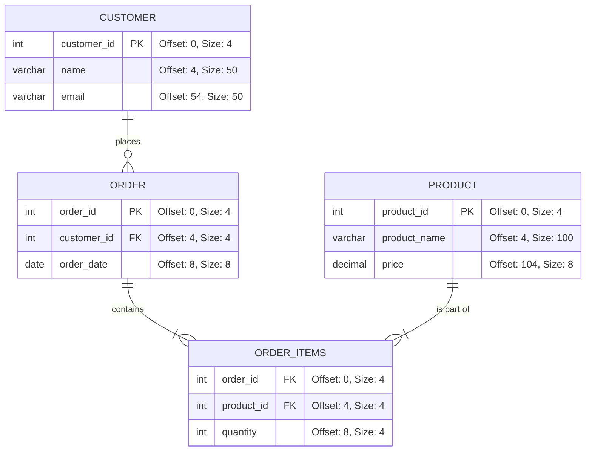
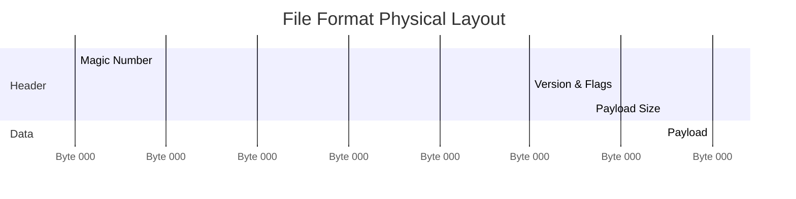

```mermaid
erDiagram
    CUSTOMER ||--o{ ORDER : places
    ORDER ||--|{ ORDER_ITEMS : contains
    PRODUCT ||--|{ ORDER_ITEMS : "is part of"

    CUSTOMER {
        int customer_id PK "Offset: 0, Size: 4"
        varchar name "Offset: 4, Size: 50"
        varchar email "Offset: 54, Size: 50"
    }

    ORDER {
        int order_id PK "Offset: 0, Size: 4"
        int customer_id FK "Offset: 4, Size: 4"
        date order_date "Offset: 8, Size: 8"
    }

    PRODUCT {
        int product_id PK "Offset: 0, Size: 4"
        varchar product_name "Offset: 4, Size: 100"
        decimal price "Offset: 104, Size: 8"
    }

    ORDER_ITEMS {
        int order_id FK "Offset: 0, Size: 4"
        int product_id FK "Offset: 4, Size: 4"
        int quantity "Offset: 8, Size: 4"
    }
```

```mermaid
gantt
    title File Format Physical Layout
    dateFormat B
    axisFormat Byte %L

    section Header
    Magic Number        :0, 4B
    Version & Flags     :4, 2B
    Payload Size        :6, 4B
    
    section Data
    Payload             :10, 256B
```