# LC_CODE_SIGNATURE

**Command ID:** `0x1D`

Points to the code signature data stored in the `__LINKEDIT` segment. The code signature is the mechanism Apple uses to verify binary integrity, enforce entitlements, validate developer identity, and apply launch constraints. Every signed Mach-O contains this load command.

The load command itself is a `linkedit_data_command` that stores a file offset and size. The referenced data begins with a **SuperBlob** — a container that holds all of the individual signature components as a table of typed, offset-indexed blobs.

## Load Command Fields

| Name | Description | Offset | Size | Type |
|------|-------------|--------|------|------|
| Command ID | Load command identifier (`LC_CODE_SIGNATURE`) | 0 | 4 | `UInt32` |
| Command Size | Total size of this load command (16 bytes) | 4 | 4 | `UInt32` |
| Data Offset | File offset of the signature data in `__LINKEDIT` | 8 | 4 | `UInt32` |
| Data Size | Size of the signature data in bytes | 12 | 4 | `UInt32` |

**Total size:** 16 bytes

---

## Signature Data Structure

All data below is big-endian. Every blob begins with a 4-byte magic number followed by a 4-byte total length (including the magic and length fields themselves).

### SuperBlob (Container)

**Magic:** `0xFADE0CC0`

The top-level container for the entire code signature. It holds a count and an index table of blobs, each identified by a slot type and an offset from the start of the SuperBlob.

| Name | Description | Offset | Size | Type |
|------|-------------|--------|------|------|
| Magic | SuperBlob magic (`0xFADE0CC0`) | 0 | 4 | `UInt32` |
| Length | Total length of the SuperBlob including all sub-blobs | 4 | 4 | `UInt32` |
| Count | Number of blob index entries | 8 | 4 | `UInt32` |
| Blob Index | Array of `(type, offset)` pairs | 12 | 8 &times; Count | `[Blob]` |

Each blob index entry is:

| Name | Description | Size | Type |
|------|-------------|------|------|
| Type | Slot type identifying the blob's role | 4 | `DirectoryType` |
| Offset | Byte offset from SuperBlob start to the blob | 4 | `UInt32` |

#### Slot Types (`DirectoryType`)

| Value | Name | Description |
|-------|------|-------------|
| `0x0000` | `cdCodeDirectorySlot` | Primary Code Directory (SHA-256 or SHA-1) |
| `0x0001` | `cdInfoSlot` | `Info.plist` hash |
| `0x0002` | `cdRequirementSlot` | Code Requirements |
| `0x0003` | `cdResourceDirectorySlot` | `_CodeSignature/CodeResources` hash |
| `0x0004` | `cdTopDirectorySlot` | Top-level application directory |
| `0x0005` | `cdEntitlementsSlot` | Entitlements (plist) |
| `0x0006` | `cdRepSpecificSlot` | Representation-specific (DMG) |
| `0x0007` | `cdCodeEntitlementsDERSlot` | Entitlements (DER-encoded) |
| `0x0008` | `cdLaunchConstraintSelf` | Launch constraint for self |
| `0x0009` | `cdLaunchConstraintParent` | Launch constraint for parent process |
| `0x000A` | `cdLaunchConstraintResponsible` | Launch constraint for responsible process |
| `0x1000` | `cdAlternateCodeDirectorySlots` | Start of alternate Code Directories |
| `0x1005` | `cdAlternateCodeDirectoryLimit` | End of alternate Code Directory range |
| `0x10000` | `cdSignatureSlot` | CMS signature (BlobWrapper) |
| `0x10001` | `cdIdentificationSlot` | Identification |
| `0x10002` | `cdTicketSlot` | Notarization ticket |

---

### Code Directory

**Magic:** `0xFADE0C02`

The central component of the code signature. Contains cryptographic hashes that verify the integrity of every page of executable code, plus hashes of other signature components (special slots). The header is versioned — newer versions append additional fields.

#### Base Header (all versions)

| Name | Description | Offset | Size | Type |
|------|-------------|--------|------|------|
| Magic | Code Directory magic (`0xFADE0C02`) | 0 | 4 | `UInt32` |
| Length | Total length of this Code Directory blob | 4 | 4 | `UInt32` |
| Version | Structure version (determines which optional fields are present) | 8 | 4 | `UInt32` |
| Flags | Code signing flags (`CodeDirectoryFlags`) | 12 | 4 | `UInt32` |
| Hash Offset | Offset from blob start to the first code slot hash | 16 | 4 | `UInt32` |
| Identifier Offset | Offset from blob start to the identifier string | 20 | 4 | `UInt32` |
| Num Special Slots | Number of special slot hashes (Info.plist, entitlements, etc.) | 24 | 4 | `UInt32` |
| Num Code Slots | Number of code page hashes | 28 | 4 | `UInt32` |
| Code Limit | Byte length of the signed code (pages are hashed up to this point) | 32 | 4 | `UInt32` |
| Hash Size | Size of each hash value in bytes | 36 | 1 | `UInt8` |
| Hash Type | Hash algorithm used | 37 | 1 | `CodeSignatureHashType` |
| Platform | Platform identifier | 38 | 1 | `UInt8` |
| Page Size | Log2 of the page size in bytes (e.g. 12 = 4096 bytes) | 39 | 1 | `UInt8` |
| Unused | Reserved | 40 | 4 | `UInt32` |

**Base header size:** 44 bytes

#### Version-Dependent Fields

| Min Version | Name | Description | Offset | Size | Type |
|-------------|------|-------------|--------|------|------|
| `0x20100` | Scatter Offset | Offset to scatter vector | 44 | 4 | `UInt32` |
| `0x20200` | Team ID Offset | Offset to team identifier string | 48 | 4 | `UInt32` |
| `0x20300` | CodeLimit64 Unused | Reserved | 52 | 4 | `UInt32` |
| `0x20300` | CodeLimit64 | 64-bit code limit for large binaries | 56 | 8 | `UInt64` |
| `0x20400` | Exec Segment Base | File offset of the executable segment | 64 | 8 | `UInt64` |
| `0x20400` | Exec Segment Limit | Size of the executable segment | 72 | 8 | `UInt64` |
| `0x20400` | Exec Segment Flags | Executable segment flags | 80 | 8 | `UInt64` |
| `0x20500` | Runtime Version | Hardened runtime version | 88 | 4 | `UInt32` |
| `0x20500` | Pre-Encrypt Offset | Offset to pre-encryption data | 92 | 4 | `UInt32` |
| `0x20600` | Linkage Hash Type | Hash type for linkage | 96 | 1 | `CodeSignatureHashType` |
| `0x20600` | Linkage App Type | Application type | 97 | 1 | `UInt8` |
| `0x20600` | Linkage App Sub Type | Application sub-type | 98 | 2 | `UInt16` |
| `0x20600` | Linkage Offset | Offset to linkage data | 100 | 4 | `UInt32` |
| `0x20600` | Linkage Size | Size of linkage data | 104 | 4 | `UInt32` |

#### Hash Algorithm Types (`CodeSignatureHashType`)

| Value | Name |
|-------|------|
| `0` | `NO_HASH` |
| `1` | `SHA1` |
| `2` | `SHA256` |
| `3` | `SHA256_TRUNCATED` |
| `4` | `SHA384` |
| `5` | `SHA512` |

#### Code Directory Flags (`CodeDirectoryFlags`)

| Value | Name | Description |
|-------|------|-------------|
| `0x00000001` | `CS_VALID` | Dynamically valid |
| `0x00000002` | `CS_ADHOC` | Ad-hoc signed (no identity) |
| `0x00000004` | `CS_GET_TASK_ALLOW` | Allows task_for_pid (debugging) |
| `0x00000008` | `CS_INSTALLER` | Has installer entitlement |
| `0x00000010` | `CS_FORCED_LV` | Library Validation forced |
| `0x00000020` | `CS_INVALID_ALLOWED` | Invalid pages are allowed |
| `0x00000100` | `CS_HARD` | Don't load invalid pages |
| `0x00000200` | `CS_KILL` | Kill process on invalid page |
| `0x00000400` | `CS_CHECK_EXPIRATION` | Check certificate expiration |
| `0x00000800` | `CS_RESTRICT` | Restrict process |
| `0x00001000` | `CS_ENFORCEMENT` | Enforce code signing |
| `0x00002000` | `CS_REQUIRE_LV` | Require Library Validation |
| `0x00004000` | `CS_ENTITLEMENTS_VALIDATED` | Entitlements have been validated |
| `0x00008000` | `CS_NVRAM_UNRESTRICTED` | NVRAM unrestricted access |
| `0x00010000` | `CS_RUNTIME` | Hardened Runtime enabled |
| `0x00020000` | `CS_LINKER_SIGNED` | Signed by the linker |

#### Special Slot Hashes

The special slots are stored immediately before the code slot hashes (growing downward in negative index order). Each is a hash over a specific signature component:

| Slot Index | Name | Hashes |
|------------|------|--------|
| -1 | `InfoSlot` | `Info.plist` |
| -2 | `RequirementsSlot` | Code Requirements blob |
| -3 | `ResourceDirSlot` | `_CodeSignature/CodeResources` |
| -4 | `TopDirectorySlot` | Application top directory |
| -5 | `EntitlementSlot` | Entitlements plist blob |
| -6 | `RepSpecificSlot` | Representation-specific slot |
| -7 | `EntitlementDERSlot` | DER-encoded entitlements blob |

#### Code Slot Hashes

An array of `Num Code Slots` hashes, one per page of executable code. Each hash covers `2^Page Size` bytes of the signed binary (up to `Code Limit`). The last page may be shorter.

---

### Code Requirements

**Magic:** `0xFADE0C01`

A container for one or more individual requirement blobs. Each requirement specifies conditions that must be true for the code to be considered valid in a given context (designated, host, library, or plugin).

| Name | Description | Offset | Size | Type |
|------|-------------|--------|------|------|
| Magic | Requirements magic (`0xFADE0C01`) | 0 | 4 | `UInt32` |
| Length | Total length of this blob | 4 | 4 | `UInt32` |
| Count | Number of requirement entries | 8 | 4 | `UInt32` |
| Requirement Headers | Array of `(type, offset)` pairs | 12 | 8 &times; Count | `[CodeRequirementHeader]` |

Each requirement header:

| Name | Description | Size | Type |
|------|-------------|------|------|
| Type | Requirement type | 4 | `MachOCodeSignatureRequirementType` |
| Offset | Offset from Requirements blob start | 4 | `UInt32` |

#### Requirement Types

| Value | Name | Description |
|-------|------|-------------|
| `1` | `host` | Requirements the host must satisfy |
| `2` | `guest` | Requirements for embedded code |
| `3` | `designated` | The canonical identity of this code |
| `4` | `library` | Requirements for loaded libraries |
| `5` | `plugin` | Requirements for plug-ins |

### Code Requirement (Individual)

**Magic:** `0xFADE0C00`

A single requirement expression encoded as a sequence of opcodes in a postfix expression language. The library parses these into expression trees and can reconstruct the human-readable requirement string (the same format as `codesign -d -r-`).

| Name | Description | Offset | Size | Type |
|------|-------------|--------|------|------|
| Magic | Requirement magic (`0xFADE0C00`) | 0 | 4 | `UInt32` |
| Length | Total length of this blob | 4 | 4 | `UInt32` |
| Kind | Expression kind | 8 | 4 | `UInt32` |
| Expressions | Postfix expression opcodes | 12 | variable | `[ExprOp]` |

---

### Entitlements (Plist)

**Magic:** `0xFADE7171`

Contains the entitlements granted to the executable as an XML or binary plist dictionary. Entitlements declare capabilities the app requires (e.g. `com.apple.security.app-sandbox`, `com.apple.developer.team-identifier`).

| Name | Description | Offset | Size | Type |
|------|-------------|--------|------|------|
| Magic | Entitlements magic (`0xFADE7171`) | 0 | 4 | `UInt32` |
| Length | Total length of this blob | 4 | 4 | `UInt32` |
| Plist Data | Property list containing entitlement key-value pairs | 8 | Length - 8 | `[String:Any]` |

---

### Entitlements DER

**Magic:** `0xFADE7172`

An alternative DER (ASN.1) encoding of the same entitlements data. Apple introduced this format for more compact and machine-parseable entitlement representation. Modern binaries typically contain both plist and DER entitlements.

| Name | Description | Offset | Size | Type |
|------|-------------|--------|------|------|
| Magic | Entitlements DER magic (`0xFADE7172`) | 0 | 4 | `UInt32` |
| Length | Total length of this blob | 4 | 4 | `UInt32` |
| DER Data | ASN.1 DER-encoded entitlement dictionary | 8 | Length - 8 | `EntitlementRoot` |

---

### BlobWrapper (CMS Signature)

**Magic:** `0xFADE0B01`

Wraps the CMS (Cryptographic Message Syntax) signature that authenticates the Code Directory. This is the actual cryptographic signature from Apple or the developer's signing identity. It contains the certificate chain and signing timestamps.

| Name | Description | Offset | Size | Type |
|------|-------------|--------|------|------|
| Magic | BlobWrapper magic (`0xFADE0B01`) | 0 | 4 | `UInt32` |
| Length | Total length of this blob | 4 | 4 | `UInt32` |
| CMS Data | DER-encoded CMS signature (PKCS#7 / RFC 5652) | 8 | Length - 8 | `CMSSignature` |

The CMS signature contains:
- **Certificates** — the full X.509 certificate chain from the signing identity up to Apple's root CA
- **Signers** — the signing identity and optional signing timestamp

---

### Launch Constraint

**Magic:** `0xFADE8181`

DER-encoded constraints that restrict how the process may be launched. Introduced in macOS 14 / iOS 17. There are three launch constraint slots:

- **Self** (slot `0x0008`) — constraints the process itself must satisfy
- **Parent** (slot `0x0009`) — constraints the parent process must satisfy
- **Responsible** (slot `0x000A`) — constraints the responsible process must satisfy

| Name | Description | Offset | Size | Type |
|------|-------------|--------|------|------|
| Magic | Launch Constraint magic (`0xFADE8181`) | 0 | 4 | `UInt32` |
| Length | Total length of this blob | 4 | 4 | `UInt32` |
| Constraint Data | DER-encoded constraint dictionary | 8 | Length - 8 | `EntitlementRoot` |

---

## Overall Structure

```mermaid
graph TD
    LC["<b>LC_CODE_SIGNATURE</b><br/><i>offset + size → __LINKEDIT</i>"]

    LC --> SB["<b>SuperBlob</b><br/><code>0xFADE0CC0</code><br/>magic | length | count"]

    SB --> CD["<b>Code Directory</b><br/><code>0xFADE0C02</code>"]
    SB --> REQs["<b>Code Requirements</b><br/><code>0xFADE0C01</code>"]
    SB --> ENT["<b>Entitlements — Plist</b><br/><code>0xFADE7171</code>"]
    SB --> DER["<b>Entitlements — DER</b><br/><code>0xFADE7172</code>"]
    SB --> CMS["<b>BlobWrapper / CMS</b><br/><code>0xFADE0B01</code>"]
    SB --> LC_SELF["<b>Launch Constraint Self</b><br/><code>0xFADE8181</code>"]
    SB --> LC_PAR["<b>Launch Constraint Parent</b><br/><code>0xFADE8181</code>"]
    SB --> ACD["<b>Alternate Code Directories</b><br/><code>0xFADE0C02</code>"]

    CD --> CDH["<b>Header</b><br/>version | flags | hashType<br/>pageSize | codeLimit"]
    CD --> CDID["<b>Identifier + Team ID</b>"]
    CD --> SSH["<b>Special Slot Hashes</b><br/><i>Info.plist, Requirements,<br/>Entitlements, Resources...</i>"]
    CD --> CSH["<b>Code Slot Hashes</b><br/><i>one per page of __TEXT</i>"]
    CD --> VER["<b>Version-Dependent</b><br/>Scatter | CodeLimit64<br/>ExecSeg | Runtime | Linkage"]

    REQs --> REQ1["<b>Designated Requirement</b><br/><code>0xFADE0C00</code><br/><i>postfix expression opcodes</i>"]

    CMS --> CERT["<b>Certificate Chain</b><br/><i>X.509 leaf → Apple Root CA</i>"]
    CMS --> SIG["<b>Signer + Timestamp</b>"]

    style LC fill:#4a90d9,stroke:#2c5f8a,color:#fff
    style SB fill:#f5a623,stroke:#c47d0e,color:#fff
    style CD fill:#7ed321,stroke:#5a9e18,color:#fff
    style REQs fill:#7ed321,stroke:#5a9e18,color:#fff
    style ENT fill:#7ed321,stroke:#5a9e18,color:#fff
    style DER fill:#7ed321,stroke:#5a9e18,color:#fff
    style CMS fill:#7ed321,stroke:#5a9e18,color:#fff
    style LC_SELF fill:#7ed321,stroke:#5a9e18,color:#fff
    style LC_PAR fill:#7ed321,stroke:#5a9e18,color:#fff
    style ACD fill:#7ed321,stroke:#5a9e18,color:#fff
```

## Source

Defined in [`Sources/SwiftMachO/LoadCommands/LC_CODE_SIGNATURE/`](../../Sources/SwiftMachO/LoadCommands/LC_CODE_SIGNATURE/).
