# LC_LOAD_DYLIB

**Command ID:** `0x0C`

## Binary Format

```mermaid
---
config:
  gantt:
    displayMode: compact
    numberSectionStyles: 2
---
gantt
    title LC_LOAD_DYLIB Structure (bytes)
    dateFormat X
    axisFormat %s

    section Header
    Command ID (0x0C)           :0, 4
    Command Size                :4, 8

    section Dylib Info
    Name Offset                 :8, 12
    Timestamp                   :12, 16
    Current Version             :16, 20
    Compatibility Version       :20, 24

    section Name String
    Library Name (null-term)    :24, 64
```

Tells the dynamic linker (`dyld`) that a dynamic library must be loaded before the executable can run. Each `LC_LOAD_DYLIB` command identifies one required dylib dependency by its install name path, along with version information used for compatibility checking.

At load time, `dyld` resolves the library by its name, verifies that its current version is at least as high as the recorded compatibility version, and binds the executable's undefined symbols against the library's exports. If the library cannot be found or the version check fails, the process aborts before `main` is called.

The name string is stored inline in the load command at the byte offset indicated by `Name Offset` (relative to the start of the command). The `Timestamp` field records the library's build timestamp from when the executable was linked.

## Fields

| Name | Description | Offset | Size | Type |
|------|-------------|--------|------|------|
| Command ID | Load command identifier (`LC_LOAD_DYLIB`) | 0 | 4 | `UInt32` |
| Command Size | Total size of this load command (including the name string) | 4 | 4 | `UInt32` |
| Name Offset | Byte offset from the start of this command to the library name string | 8 | 4 | `UInt32` |
| Timestamp | Build timestamp of the linked library | 12 | 4 | `UInt32` |
| Current Version | Current version of the library at link time | 16 | 4 | `SemanticVersion` |
| Compatibility Version | Minimum compatible version required at runtime | 20 | 4 | `SemanticVersion` |
| Name | Null-terminated install name path of the dynamic library | `Name Offset` | variable | `String` |

**Minimum size:** 24 bytes (header + fixed fields, before name string)

## Source

Defined in [`Sources/SwiftMachO/LoadCommands/LC_LOAD_DYLIB.swift`](../../Sources/SwiftMachO/LoadCommands/LC_LOAD_DYLIB.swift).
